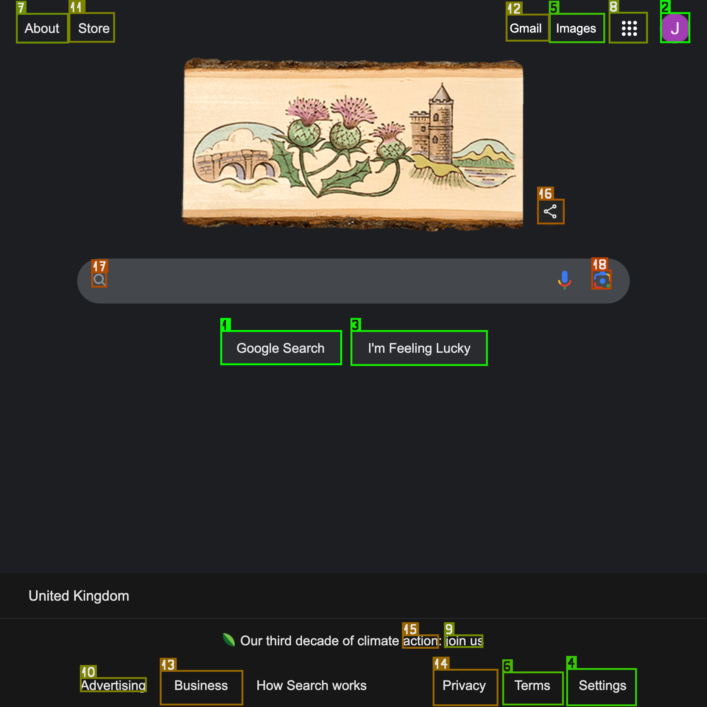

# OmniParserIconDetectors.jl

[](https://svilupp.github.io/OmniParserIconDetectors.jl/stable/) [](https://svilupp.github.io/OmniParserIconDetectors.jl/dev/) [](https://github.com/svilupp/OmniParserIconDetectors.jl/actions/workflows/CI.yml?query=branch%3Amain) [](https://codecov.io/gh/svilupp/OmniParserIconDetectors.jl) [](https://github.com/JuliaTesting/Aqua.jl)

A lightweight Julia wrapper for Microsoft's OmniParser icon detection model that:
- Automatically detects UI elements like buttons and icons in screenshots
- Provides precise location and confidence scores for each detected element
- Includes visualization tools to highlight detected elements

Perfect for automated UI testing, accessibility tools, and computer vision applications.
It's powered by Microsoft's [OmniParser](https://microsoft.github.io/OmniParser/) model and ONNXRunTime.jl.

See the [Project Page](https://microsoft.github.io/OmniParser/) for more information about the model or try it out in the [HuggingFace Demo](https://huggingface.co/spaces/microsoft/OmniParser).

## Installation

```julia
using Pkg
# Install the package
Pkg.add(url="https://github.com/svilupp/OmniParserIconDetectors.jl")

# Set the environment variable to allow for automatic downloads
ENV["DATADEPS_ALWAYS_ACCEPT"] = "true"
```

## Getting Started

### Loading the model

```julia
ENV["DATADEPS_ALWAYS_ACCEPT"] = "true" # Allow for automatic downloads
using OmniParserIconDetectors

# Load the model (downloads weights automatically)
model = load_detection_model()

# Run detection on an image
img = joinpath("test", "images", "test1.png")
detections = detect_icons(model, img)

# Draw the detections on the image
out = draw_detections(img, detections; save_path = "examples/detection_example.png")

```

Voila!



## Usage

### Basic Detection
```julia
using OmniParserIconDetectors

# Load the model (downloads weights automatically)
# Note: First load might take a few minutes to download the model weights (~850MB)
model = load_detection_model()

# Example paths - both local files and URLs are supported
img_path = "test/images/test1.png"
# url_path = "https://example.com/image.png"

# Detect icons in an image - multiple ways to do it:
# 1. Using the convenience function
detections = detect_icons(model, img_path) #

# 2. Using the model directly (same as above)
detections = model(img_path)

# 3. With verbose output for debugging - useful for troubleshooting
detections = model(img_path; verbose=true)

# The output is a Vector{DetectedItem}, where each item contains:
# - id: Integer identifying the icon class (1-100)
# - confidence: Float64 detection confidence score (0-100)
# - bbox: Tuple of (x1, y1, x2, y2) coordinates in pixels
```

Note: Use `detect_icons(model, img_path; verbose=true)` for debugging and to see the details!

### Visualization

You can visualize the detections by drawing bounding boxes on the original image:
```julia
using OmniParserIconDetectors: load_image

# Load any image (supports common formats: png, jpg, etc.)
img = load_image("test/images/test1.png")

# Example detections
detections = [
    DetectedItem(id=1, confidence=99.0, bbox=(50.0, 50.0, 200.0, 200.0)),  # High confidence detection
    DetectedItem(id=22, confidence=85.5, bbox=(250.0, 100.0, 400.0, 250.0))  # Medium confidence detection
]

# Draw boxes and save the result
img_with_boxes = draw_detections(img, detections; 
    save_path="output.png",  # Optional: save to file
)

# Or just draw boxes without saving
img_with_boxes = draw_detections(img, detections)
```

### Detection Results
Each `DetectedItem` contains:
- `id`: Unique identifier for the detected icon type (1-100)
- `label`: Class label (if available, not implemented yet)
- `bbox`: Tuple of (x1, y1, x2, y2) coordinates in original image space
- `confidence`: Detection confidence score (0-100)

### Examples

Check out the `examples/` folder for sample code and detection results:
- `examples/detection_example.jl` - Example of detected UI elements
- `examples/drawing_example.jl` - Example of using the drawing utilities


## Model Weights License - AGPL!

This package uses the OmniParser icon detection model from Microsoft, available at:
https://huggingface.co/onnx-community/OmniParser-icon_detect

> [!IMPORTANT]

For the model checkpoint, please note that icon_detect model is under **AGPL license** since it is a license inherited from the original yolo model. Please refer to the `LICENSE_MODEL` or the original file at [HuggingFace Repo](https://huggingface.co/microsoft/OmniParser/resolve/main/icon_detect/LICENSE).

The model weights are downloaded automatically from [HuggingFace](https://huggingface.co/onnx-community/OmniParser-icon_detect) when the package is loaded, but you must set `ENV["DATADEPS_ALWAYS_ACCEPT"] = "true"` to allow for automatic downloads.
